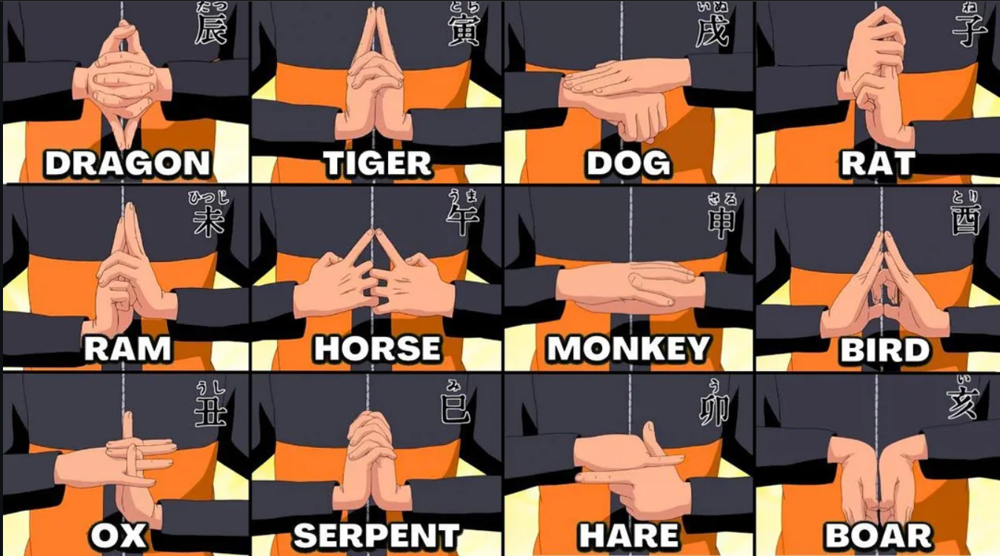

# Kekkai — Naruto Hand Sign AR Jutsu

Real-time hand-sign recognition in the browser: form a Naruto hand seal in
front of a camera and a jutsu effect (Rasengan, Sharingan, Chidori, ...)
appears anchored to your hand. Runs entirely client-side — a laptop webcam
or a phone camera, no server, no install beyond a browser.

**Live:** https://ashfaknawshad.github.io/naruto-ar-jutsu/ — auto-deployed
from `master` via GitHub Actions, so it always reflects the latest commit.

Full design doc: [naruto-jutsu-ar-project-plan.md](naruto-jutsu-ar-project-plan.md)
(visitor experience, jutsu catalogue, booth setup, ethics).
Solo execution plan: [SOLO-PLAN.md](SOLO-PLAN.md) (stack decision, architecture,
day-by-day build schedule).

## The 12 seals



These are the gesture classes the model is trained to recognise (plus
`transition` and `none`, for movement between seals and everything else).

## Status

Building day-by-day per [SOLO-PLAN.md](SOLO-PLAN.md) §6. Check off as we go:

- [x] **Day 1** — camera device picker, live 21-point hand skeleton overlay, FPS/latency HUD
- [x] **Day 2** — landmark feature normalisation (`src/perception/features.ts`) + the dataset recorder tool (`?mode=record`)
- [x] **Day 3** — recorded dataset (14 recorders), classifier (`train/`, cross-validated ~76-87% depending on split), live seal recognition with smoothing
- [x] **Day 4** — Three.js stage, hand anchoring, One Euro filter
- [x] **Day 5** — Rasengan shader (core + procedural streak-field shell + orbiting particles)
- [ ] **Day 6** — occlusion, charge/thrust loop
- [ ] **Day 7** — post FX, audio, photo capture (**vertical slice gate**)
- [ ] Days 8–12 — remaining jutsu, tutorial UI, booth polish, deploy

## Stack

TypeScript + Vite, [MediaPipe Tasks](https://ai.google.dev/edge/mediapipe) for
hand/face/segmentation, Three.js for rendering. No backend, no ML framework —
the classifier is a small hand-rolled MLP trained offline on landmark
coordinates, not images.

## Running it locally

```bash
npm install     # also fetches the MediaPipe model/wasm assets (see below)
npm run dev     # https://localhost:5173
npm run dev:lan # also exposes https://<your-lan-ip>:5173 for a phone on the same wifi
```

First run needs HTTPS (browsers require it for camera access off `localhost`)
— accept the self-signed certificate warning once. The hand-tracking model
(~8 MB) and MediaPipe's WASM runtime are downloaded once by
`scripts/fetch-assets.mjs` (runs automatically on `npm install`) and served
locally from then on, so the app doesn't depend on a CDN at runtime.

## Contributing a hand-sign dataset

We need real hands — not just mine — recording each of the 12 seals so the
classifier generalises instead of overfitting to one person. If you're
helping with this, thank you — here's how.

**1. Record your seals.**
Open **https://ashfaknawshad.github.io/naruto-ar-jutsu/?mode=record** on
your phone or laptop — nothing to install, just allow camera access. The
seal chart above is shown right in the app (top-right, toggle with the
"Hide/Show seal chart" button if it's in the way). For each seal:

- Type your name once (top-left field) — it stays saved in your browser.
- Pick the seal from the dropdown.
- Tap **Space** (or click Start) *before* putting your hands up — you get a
  3-second countdown, then it captures automatically for 2 seconds. Nothing
  needs to be held during the pose, so two-handed seals are fine.
- Check **auto-repeat** to do several reps of the same seal back-to-back.
- Made a mistake? Press **Backspace** right after a take to discard just that
  one, no need to redo everything.

Also record a chunk of **`none`** — waving, adjusting glasses, clapping,
scratching your head, arms crossed, hands in pockets. Ordinary movement that
*isn't* a seal is at least as important as the seals themselves; it's what
stops the effect firing when nobody's actually casting a jutsu.

Aim for a few dozen reps per class if you can, across a couple of lighting
conditions / distances if you're up for it. More is better but don't stress
over hitting an exact number.

**2. Send it in.** When you're done, click **Download JSON** — it saves a file
named `kekkai-dataset-<yourname>-<timestamp>.json`. Only landmark coordinates
are in that file, never video or images, so it's a small file safe to share
freely. Two ways to get it into the project:

- **No git needed (easiest):** just send the file to me directly (Discord/WhatsApp/email/whatever) and I'll add it.
- **If you're comfortable with git:** create a branch (e.g. `dataset/yourname`), drop the file into `datasets/raw/` unmodified, commit, push, and open a pull request. See [datasets/raw/README.md](datasets/raw/README.md) for the folder's conventions.

Either way, please keep each session as its own file rather than merging
people together — the training step splits people between train and test
sets, and that only works if each file is traceable to one person.
